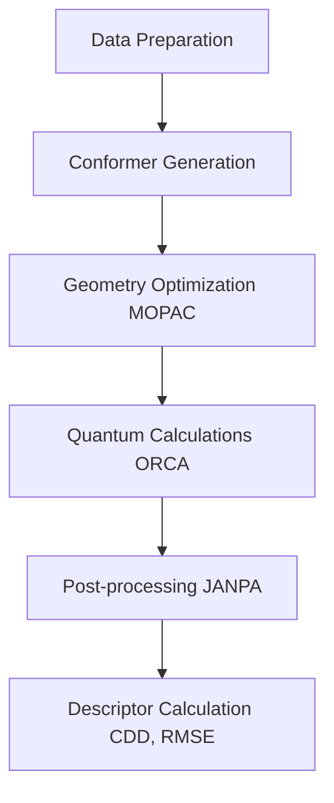

### Project Pipeline Overview and Execution

This project involves quantum chemical calculations for molecular reactivity prediction using the **FukuiNet** model. The pipeline processes molecular data in several steps, starting with SMILES strings and ending with post-processed quantum descriptors ready for machine learning models. Here's an overview of each step:

---

### Pipeline Structure:

1. **Data Preparation**:
    - **Script**: `01_prepare_data.py`
    - **Description**: This script processes the SMILES strings in the input dataset, canonicalizes them, and checks for duplicates. It also merges additional datasets.
    - **Input**: `../data/QM_137k.csv`, other CSV files in the `data/` folder.
    - **Output**: `smiles_id.csv`, which contains canonical SMILES for further processing.

2. **Conformer Generation**:
    - **Script**: `02_generate_conformers.py`
    - **Description**: For each molecule, this script generates 5 conformers (3D geometries) and saves them in SDF format.
    - **Input**: `smiles_id.csv` (generated in the previous step).
    - **Output**: SDF files saved in the `sdf_files/` folder.

3. **Geometry Optimization with MOPAC**:
    - **Script**: `03_run_mopac.py`
    - **Description**: This script uses MOPAC to optimize the geometries of the generated conformers. It reads the SDF files and runs MOPAC on each molecule.
    - **Input**: SDF files from `sdf_files/`.
    - **Output**: Optimized geometry files saved in `calc_<number>` directories.

4. **Quantum Calculations with ORCA**:
    - **Script**: `04_run_orca.sh`
    - **Description**: This shell script runs ORCA for different charge states (neutral, anion, cation) and multiplicities of each molecule. It processes the input files and generates the quantum results.
    - **Input**: ORCA input files (`.inp`) from `orca_files_comp/`.
    - **Output**: ORCA output files (`.out`) saved in the `orca_files_comp/out/` folder.

5. **Post-processing with JANPA**:
    - **Script**: `05_postprocess_orca.py`
    - **Description**: This script takes the ORCA output files and runs JANPA to extract population and electronic structure data. It processes the files and moves the final results into the `janpa_done/` folder.
    - **Input**: ORCA output files from `orca_files_comp/out/`.
    - **Output**: JANPA results saved in `janpa_done/`.

6. **Data Extraction and Descriptor Calculation**:
    - **Script**: `06_process_janpa_results.py`
    - **Description**: This script reads the JANPA output, calculates Hirshfeld charges, Fukui indices, and the Condensed Dual Descriptor (CDD) for each molecule. It also computes the root mean square error (RMSE) for charge distributions.
    - **Input**: Files from the `janpa_done/` folder.
    - **Output**: Final data containing descriptors ready for machine learning analysis.

---

### Folder Structure:

```
├── data/                   # Raw and processed datasets
│   ├── external/           # Data from third-party sources
│   ├── interim/            # Intermediate processed data
│   ├── processed/          # Final data used for modeling
│   └── raw/                # Original, immutable raw data
│
├── sdf_files/              # Generated SDF files for molecular conformers
│
├── calc_<number>/          # MOPAC calculation directories for each batch of molecules
│
├── orca_files_comp/        # ORCA input files and intermediate results
│   ├── out/                # ORCA output files
│   └── tmp/                # Temporary files for ORCA execution
│
├── janpa_done/             # Final processed files from JANPA
│
├── scripts/                # Pipeline and utility scripts
│
├── logs/                   # Log files tracking pipeline execution
│
└── results/                # Final results (CDDs, indices, and RMSEs)
```

---

### Running the Pipeline

To execute the pipeline, follow these steps:

1. **Data Preparation**:
    Run the `01_prepare_data.py` script to process and canonicalize SMILES strings:
    ```bash
    python scripts/01_prepare_data.py
    ```

2. **Conformer Generation**:
    Generate conformers for each molecule using `02_generate_conformers.py`:
    ```bash
    python scripts/02_generate_conformers.py
    ```

3. **MOPAC Geometry Optimization**:
    Run MOPAC optimization on generated conformers using `03_run_mopac.py`:
    ```bash
    python scripts/03_run_mopac.py
    ```

4. **ORCA Quantum Calculations**:
    Execute ORCA for quantum chemical calculations by running the shell script:
    ```bash
    bash scripts/04_run_orca.sh
    ```

5. **JANPA Post-processing**:
    Post-process the ORCA output files using JANPA with `05_postprocess_orca.py`:
    ```bash
    python scripts/05_postprocess_orca.py
    ```

6. **Descriptor Calculation**:
    Extract the final data, calculate CDD and RMSE using `06_process_janpa_results.py`:
    ```bash
    python scripts/06_process_janpa_results.py
    ```

---

This pipeline allows for efficient processing of molecular quantum calculations, descriptor extraction, and preparing data for machine learning models.



